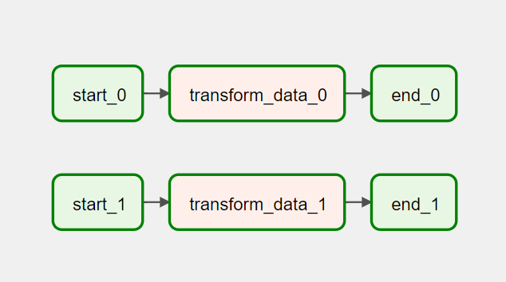

## Data Pipe Line

Simple DAG as below:



Step 1: Strip Empty Name rows

Step 2: Split `name` column into `first_name` and `last_name`

|first_name | last_name |    price     | 
|:----------|:----------|--------------|
| William   | Dixon     |  109.0372796 |

Step 3: Remove salutation from first name column

Step 4: Remove any zeros prepended to the `price` field

Step 5: Create a new field named `above_100`, which is `true` if the price is strictly greater than 100

|first_name | last_name |    price     | above_100  |
|:----------|:----------|--------------|:----------:|
| William   | Dixon     |  109.0372796 | true       |

Step 6: Write into destination

Step 7: housekeeping, delete or move original files to different location

## Start Airflow

```bash
docker-compose up
```

DAG is scheduled at 1:30 AM daily.