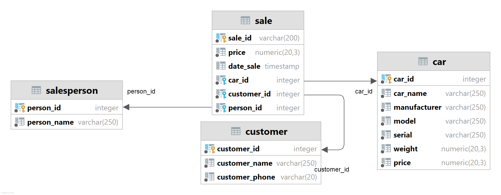

## ER Diagram
The ER Diagram of DB is this:



## DB Variables
Set the variables in `sql/fill_tables.sql`
| Parameter | Description |
| ------ | ------ |
| number_of_sales | Number of rows to create in the table sale |
| number_of_customers | Number of rows to create in the table customer |
| number_of_cars | Number of rows to create in the table car |
| number_of_salespersons | Number of rows to create in the table salesperson |
| start_date | Date of the first sale |
| end_date | Date of the last sale |

## Params
If want change this params in `docker-compose.yaml`
| Parameter | Description |
| ------ | ------ |
| POSTGRES_USER | The Postgres user to connect **postgres** |
| POSTGRES_PASSWORD | The Postgres password to connect **postgres** |
| POSTGRES_DB | The Postgres database name to connect **postgres** |
| port | The port mapped by Postgres is **5432** in your container. 
In this test, use the port **5438** on the host machine |

## Run

### Docker compose

```bash
docker-compose up
```

### Docker file

```bash
docker build -t postgres-db ./
docker run -d --name postgresdb-container -p 5438:5432 postgres-db
```

In case you want to remove the image:
```bash
docker image rm 'nameOfTheImage'
```

## Answer
The query for the test can be found under `sql/query_sales.sql`